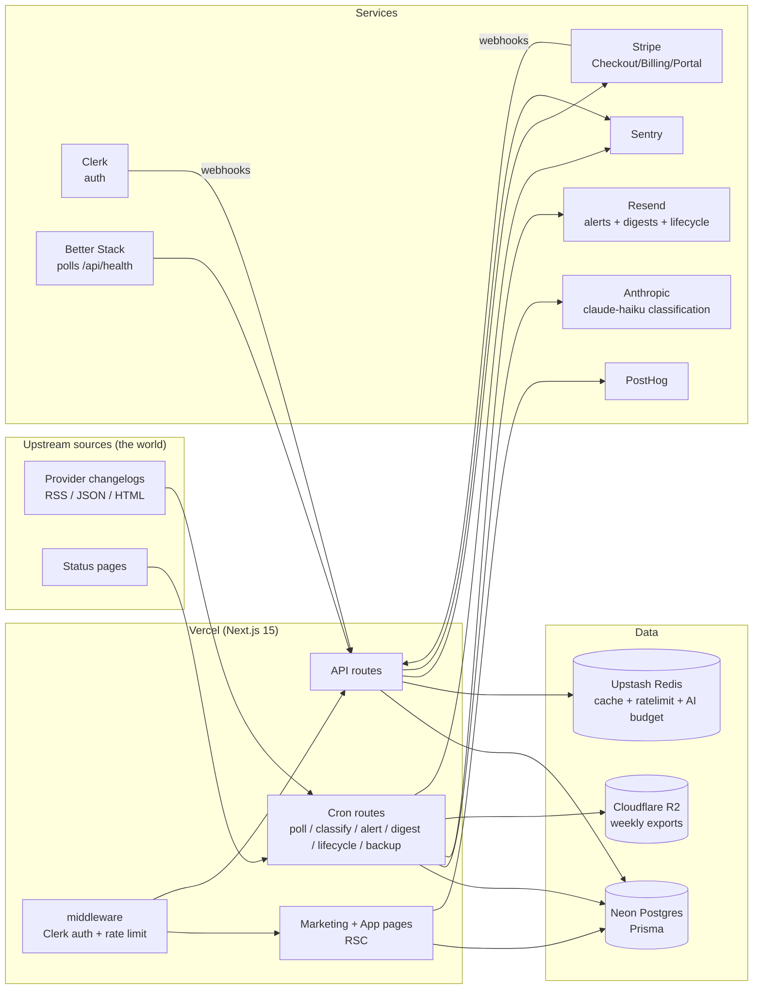

# Upstream — System Architecture

One sentence: Upstream watches every API your product depends on and tells you
what will break you, before it does.

## System diagram

## Data flow (the core loop)

1. `poll-sources` (every 30 min): fetch each enabled `Source`, hash the body,
   skip if unchanged, otherwise extract new entries → insert `Change` rows
   with `status=PENDING` (deduped by `(providerId, externalKey)`).
2. `classify-changes` (every 15 min): batch PENDING changes → Claude Haiku
   with a strict JSON schema → `kind`, `severity`, `summary`,
   `affectedSurfaces`, `actionRequired`, `effectiveAt`. Budget-capped per day;
   over-budget items simply wait. 3 failed attempts → `FAILED` (surfaced
   unclassified in feeds, never dropped).
3. `send-alerts` (every 15 min): CLASSIFIED changes with severity ≥ HIGH →
   fan out to watchers on paid plans (instant email + Team webhooks). Fan-out
   idempotency via unique `(userId, changeId, channel)`.
4. `send-digests` (Mon 09:00 UTC): weekly summary for every user with ≥1
   watch, covering the last 7 days of their stack.
5. `lifecycle-emails` (daily): welcome-follow-ups keyed by `EmailLog`
   uniqueness — each template fires at most once per user, ever.
6. `backup-export` (Sun 03:00 UTC): JSON export of users/watches/changes → R2.

## API contract

All error responses: `{ "error": { "code": ErrorCode, "message": string, "requestId": string } }`.
Auth = Clerk session unless noted. All bodies validated with zod server-side.

| Route | Method | Auth | Request | Success | Errors |
|---|---|---|---|---|---|
| `/api/health` | GET | none | — | `{ status, checks, timestamp }` | 503 when unhealthy |
| `/api/watches` | POST | session | `{ providerSlug }` | `201 { watch }` | 402 `LIMIT_REACHED`, 404 `NOT_FOUND`, 409 `ALREADY_EXISTS` |
| `/api/watches` | DELETE | session | `{ providerSlug }` | `200 { ok: true }` | 404 `NOT_FOUND` |
| `/api/projects` | POST | session | `{ name, manifest?, webhookUrl? }` | `201 { project }` | 402 `LIMIT_REACHED`, 400 `VALIDATION` |
| `/api/impact` | POST | session | `{ manifestJson, projectId? }` | `201 { report, publicUrl }` | 400 `VALIDATION`, 402 `LIMIT_REACHED` |
| `/api/impact/attribution` | POST | session | `{ reportId, shown }` | `200 { ok }` | 402 `UPGRADE_REQUIRED` (free users cannot hide) |
| `/api/alerts/read` | POST | session | `{ alertIds }` | `200 { ok }` | 400 `VALIDATION` |
| `/api/stripe/checkout` | POST | session | `{ plan: "PRO"\|"TEAM", interval: "month"\|"year" }` | `200 { url }` | 400 `VALIDATION`, 502 `STRIPE_ERROR` |
| `/api/stripe/portal` | POST | session | — | `200 { url }` | 404 `NOT_FOUND` (no customer), 502 `STRIPE_ERROR` |
| `/api/webhooks/stripe` | POST | Stripe signature | raw event | `200` | 400 bad signature (no retry), 500 (Stripe retries) |
| `/api/webhooks/clerk` | POST | Svix signature | raw event | `200` | 400 bad signature |
| `/api/cron/*` | GET | `Bearer CRON_SECRET` | — | `200 { ok, ...stats }` | 401 `UNAUTHORIZED` |

ErrorCode enum: `VALIDATION, UNAUTHORIZED, FORBIDDEN, NOT_FOUND, ALREADY_EXISTS,
LIMIT_REACHED, UPGRADE_REQUIRED, RATE_LIMITED, STRIPE_ERROR, AI_UNAVAILABLE, INTERNAL`.

## Failure modes

| Dependency | Failure | Automatic response | User sees |
|---|---|---|---|
| Anthropic API | down / 529 | Retry ×3 w/ backoff+jitter; then change stays PENDING; daily budget guard unaffected. Feeds render unclassified entries with "classification pending" chip. | Full feed; newest items tagged “analyzing”. Never blocked. |
| Neon Postgres | down | Health flips unhealthy → Better Stack pages founder. Serverless retries per-request; marketing pages are static and stay up. | Marketing fine; app shows friendly “we’re reconnecting” state via error boundary. |
| Neon slow | latency | Pooled connections (pgbouncer), per-request `connection_limit`, hot reads (provider registry, public pages) cached in Redis 5 min / ISR 1 h. | Slightly stale public pages. |
| Upstash Redis | down | Rate limiter fails open (availability > throttling); caches bypass to DB. | Nothing. |
| Stripe API | down | Checkout/portal return `STRIPE_ERROR` with retry guidance; entitlements read from our DB, so paid features keep working. | “Stripe is having trouble — try again in a minute.” |
| Stripe webhooks delayed | delay | Idempotent handlers + `WebhookEvent` ledger; Stripe retries for 72 h. Entitlement updates are eventually consistent. | Possible minutes-level delay in plan flip; upgrade page polls. |
| Resend | down | Send wrapped in retry ×2; alert rows keep `sentAt=null` so the next cron re-attempts them. Lifecycle sends are date-window based, not day-exact. | Alert arrives late, never lost. |
| A changelog source | 404 / moved | `consecutiveFailures++`; at 5 the source auto-disables and Sentry captures a “source rot” event with the URL. Other sources for the provider continue. | Nothing. |
| R2 | down | Backup cron logs failure; 2 consecutive failures → Sentry alert. Primary data unaffected (Neon PITR is the real backup). | Nothing. |

## Scaling

- **10k users:** nothing breaks. Polling cost is per-source, not per-user
  (~40 sources every 30 min). Classification ~50–200 calls/day. Digest fan-out
  10k emails/week — chunked sends within one cron invocation.
- **100k users:** digest + alert fan-out outgrows a 300 s function. Migration
  path (already isolated behind `lib/` seams): move fan-out to QStash queues
  (publish userId batches, worker route consumes). Read load on public
  provider pages is ISR-cached; DB adds a read replica if needed.
- **1M users:** the registry grows to thousands of sources → shard poll cron
  by `Source.id % N` across N schedules; move classification to a Railway
  worker with a proper queue; Postgres partitions `Change` and `Alert` by
  month (both are append-only). Auth/billing (Clerk/Stripe) scale independently.

First thing to break at each step is deliberately the fan-out, and the seam
(`lib/alerts.ts` consumed by thin cron routes) is where the queue slots in.

## Deviations from the suggested stack

- **No Groq:** one AI vendor, one failure surface. Latency is irrelevant —
  classification is async batch work. Degradation strategy (pending states)
  beats a second vendor.
- **No QStash on day one:** Vercel cron covers every job at launch scale; the
  queue is a documented migration, not a launch dependency.
- **shadcn/ui implemented as owned primitives:** the handful of primitives
  used (button, card, badge, dialog, input) are written directly against the
  token system rather than generated — less surface, zero drift.
